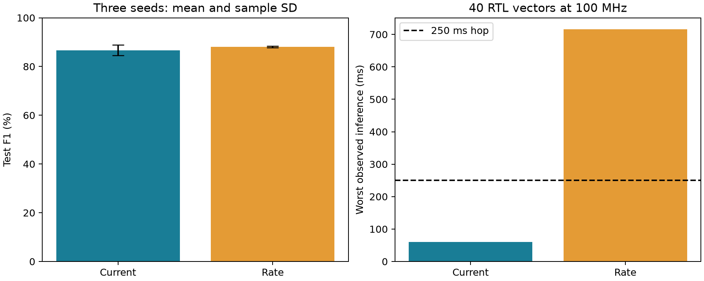

# Group 2: spiking keyword detection on PicoRV32

## Research question and outcome

Can an integer SNN detect **yes** while fitting the PYNQ-Z2's 256 KiB
RISC-V BRAM and completing inference inside a 250 ms streaming hop?
The hypothesis was that caching a constant spectrogram projection would
reduce latency substantially relative to rate encoding without a large
detection-quality penalty. The results support that hypothesis for this
fixed 768–64–2 topology and this dataset; they do not establish a general
advantage of one encoding or SNNs over ANNs.

The deployed model is **current_seed2**: precision 90.15%,
recall 85.20%, F1 87.61%. Its maximum observed RTL
latency was **59.82 ms** at 100 MHz.
On the physical PYNQ-Z2, loaded over JTAG because the board's SD card does
not boot, all 40 verification vectors ran bit-exact with RTL cycle counts.
Later work is summarized below and logged in `JOURNAL.md`.

## Dataset, controls, and training

Speech Commands v0.02 contains 105,829 isolated spoken-word clips. The
official split supplies 84,843 training, 9,981 validation, and 11,005 test
clips; positive counts are 3,228, 397, and 419. Speaker sets are checked for
disjointness. All 34 non-keyword words form the negative class. The archive
SHA256 and source URL are recorded in `results/dataset.json`.

Each encoding was trained with seeds 0, 1, and 2, AdamW (initial learning
rate 0.002, cosine decay, weight decay 0.001), batches of 256, and 35 epochs
of 16,384 samples. Sampling is balanced with replacement, so an epoch is
an optimization budget rather than one pass over every recording. Training
uses log-amplitude/feature perturbations and 4% zero-feature silence.
There are 25 floating-point warmup epochs and ten Q10 fake-quantized epochs;
only checkpoints from the last ten epochs are eligible for export.
Hidden spike activity has a 1e-4 regularizer. Full loss and validation
histories, configuration, device, and wall time are retained for all six runs.
Training used an NVIDIA RTX 4060 Laptop GPU with PyTorch 2.11.0+cu128.

The checkpoint and score threshold maximize validation F1. The unconstrained
validation winner was rate seed 2. The required 250 ms hop then excludes
rate encoding on measured processor latency, so the highest-validation-F1
current model is deployed. This feasibility decision uses latency and
validation F1, not held-out test accuracy. Test scores were not used for
training, threshold calibration, or seed selection.

## Frontend, network, and fixed-point semantics

The PC pads or truncates mono PCM16 audio to one second at 16 kHz. It uses
a 400-sample periodic Hann, 160-sample hop, 512-point FFT, 24 normalized
triangular HTK mel filters from 80 to 7600 Hz, log-power clipping to
[-80,0] dB, and mean pooling to 32 time bins. Values map to uint8 and
flatten mel-major to 768 bytes. Training and the PC demo call the same
frontend; the test suite checks cached features against WAV replay.

Both SNNs use 64 LIF neurons, 12 steps, beta=7/8, threshold one, immediate
subtractive reset, and an accumulated **nonspiking linear readout**. Only
the hidden layer emits spikes. Every inference resets membrane/phase state.
Current encoding caches W*x+b; rate encoding uses a deterministic per-pixel
phase accumulator (add input byte, spike at 255, subtract 255).

Weights use signed int16 Q10, biases/accumulators use int32. Constant drive
is trunc(sum(w*x)/255)+b. Membrane update is trunc(7*v/8)+drive; at v>=1024,
subtract 1024 and increment the spike count. Signed divisions truncate to
zero in both C and the independent NumPy oracle. The final margin threshold
is 2674. Export checks conservative accumulator bounds.
No softmax or floating-point operations run on the RISC-V processor.

## Detection results

| Encoding | Seed | Validation F1 | Test precision | Test recall | Test F1 | Negative clip FPR |
|---|---:|---:|---:|---:|---:|---:|
| current | 0 | 0.8986 | 0.9068 | 0.8592 | 0.8824 | 0.350% |
| current | 1 | 0.8866 | 0.8458 | 0.8377 | 0.8417 | 0.605% |
| current | 2 | 0.9035 | 0.9015 | 0.8520 | 0.8761 | 0.368% |
| rate | 0 | 0.9077 | 0.9169 | 0.8425 | 0.8781 | 0.302% |
| rate | 1 | 0.9063 | 0.9135 | 0.8568 | 0.8842 | 0.321% |
| rate | 2 | 0.9100 | 0.9105 | 0.8496 | 0.8790 | 0.331% |

Across three seeds, current F1 is 0.8667 ± 0.0219
and rate F1 is 0.8805 ± 0.0033
(sample standard deviation, not a confidence interval). Three seeds are
too few for a strong significance claim.

The deployed confusion matrix is TP=357, FP=39, FN=62, TN=10547.
The quantized and unquantized selected checkpoint disagree on
3 test decisions at the same threshold;
that is quantization sensitivity, not a C/RTL implementation mismatch.
All 398 additional nonoverlapping background-noise windows had
0 false detections. Background recordings were not
used in training; see `results/background_noise.json` for the six sources.

## Processor cost and memory

| Encoding | Mean cycles | Maximum cycles | Maximum ms at 100 MHz |
|---|---:|---:|---:|
| Current | 5978927 | 5981521 | 59.82 |
| Rate | 59493791 | 71552298 | 715.52 |

Mean latency improves by 9.95x. These are actual
cycles of the compiled RV32IM binary executing on the repository RTL, not
PC timing or instruction-count estimates. The 40 vectors include 12 positive,
12 negative, eight margin-boundary clips, repeated inputs, zero/saturated
inputs, and four fixed-seed random inputs. Maxima are observed stress-test
values, not a formal worst-case-execution-time proof. Ethernet, PC feature
extraction, Linux scheduling, and one-second window accumulation are outside
the firmware timer interval; 59.82 ms is not end-to-end microphone latency.

The constant projection performs 49,152 MACs once per clip; rate encoding
scans 589,824 input/weight positions over 12 steps and adds active weights.
Both perform 768 LIF updates and a 128-term readout. Deployed mean hidden
spikes are 45.87 per test clip. The C readout multiplies
accumulated spike counts; it is not an event-dispatched hardware readout.
Spike counts and operation counts are cost proxies only. No energy was measured.

The model uses 98,824 bytes, with 768 input bytes and
a reserved 16 KiB stack. Code is below 0x10000; mailbox is at 0x10400;
input at 0x10800; model at 0x18000–0x3bfff; stack at 0x3c000–0x3ffff.
The linker rejects code/model overlap. The flat binary includes address gaps;
file length is therefore larger than parameter storage.

## Verification and FPGA implementation

1. The shared frontend, hand-computed LIF case, signed arithmetic, threshold
   ties, TCP framing, malformed lengths, and real-model TCP replay pass pytest.
2. The production inference C code, compiled natively, matches every score
   and hidden-spike count for all **11,005** held-out clips.
3. The same C compiled for RV32IM matches the independent oracle on all
   **40** RTL vectors for each encoding. Firmware is loaded through the
   host BRAM port and fetched/executed by the real PicoRV32 RTL. CPU traps
   and mailbox timeouts fail the harness.
4. Icarus four-state tests cover independent AXI AW/W arrival, backpressure,
   byte enables, read/write overlap, LED retrigger/cancel/reset, initialized
   timer and wraparound. Verilator also executes and measures one full
   **100,000,000-cycle** LED pulse. Duplicate requests and malformed commands
   are checked before/after normal firmware inference.
5. Vivado 2025.2 implemented XC7Z020 at 100 MHz: setup slack
   +0.517 ns, hold slack +0.031 ns;
   2699 LUTs, 2588 registers,
   64 BRAM36 tiles, 6 DSPs.
   Bitstream generation succeeded; routed implementation reported no
   critical warnings or errors. DRC retains ten advisory DSP-pipelining
   warnings. The ten LED outputs intentionally have no external synchronous
   output-delay requirement. Internal endpoints are constrained.

Hardware fixes include AXI arbitration across a pending BRAM read, byte
strobes on syscon scratch, defined timer initialization, Zynq DDR/fixed-I/O
connections, and the CFGBVS constraint spelling. The added LED countdown
runs independently of firmware and retriggers for one second on each positive
request. ABI version 2 prevents use of the old bitstream with the new server.

The raw timing/utilization/DRC reports and artifact SHA256 values are retained.
The vendored board preset still produces PS DDR skew advisories during IP
configuration; its board trace parameters were not arbitrarily altered.

## Demonstration and remaining physical work

The PC microphone frontend sends bounded, versioned TCP requests to an ARM
server. The server loads the firmware/model into PL BRAM, posts a mailbox
request, and returns the core's scores, cycle count, spikes, and decision.
This can also run locally with an integer-model server; simulated-server
cycle fields are zero to avoid presenting fabricated processor timing.

Inference, cycle counts, and LED timing were measured on the board through a
JTAG workaround (`jtag/`), needed only because this board's SD card fails
to boot (BootROM error 0x200A). Reflashing the card should restore the
standard path. The Ethernet server on PYNQ Linux, the PYNQ clock setup,
calibrated microphone accuracy, continuous-speech false accepts per hour,
acoustic robustness, power, and long-duration stability remain physical
acceptance checks. The isolated-word recall is about 85%,
so missed detections remain a substantive model limitation. A 1 s sliding
window does not constitute a validated wake-word product. Do not claim board
measurements or energy savings from these results.

## Later work (see JOURNAL.md)

- **`kdot` custom instruction.** A PicoRV32 PCPI coprocessor streams the
  input-layer dot products from BRAM. Worst-case inference drops from
  5.98 M to 0.27 M cycles (22.4×, 2.67 ms), bit-exact in RTL and on the board.
  Setup slack +0.745 ns; 2879 LUTs,
  8 DSPs.
- **"2 of 3" confirmation.** A stream window counts only if one of the two
  previous windows also passes a validation-tuned threshold. On held-out
  clips in noise at the 250 ms hop, "yes" detected / other words accepted
  goes from 74.5% / 1.07% to 67.3% / 0.13%.
- **Confusable endings.** Augmentation from real "yes" recordings
  (`augment.py`) yields a trial model. With 2 of 3 it scores
  60.1% / 0.50% live. On held-out synthesized words it detects
  "yeets"-type 11.8%, "pizza" 3.1%,
  and "ch" words 0.8%, against 52.8%,
  11.5%, and 5.5% for the release model with
  2 of 3. It is not the release model because of its lower recall. An
  informal microphone test found that 2 of 3 removed most false "yes" on
  made-up /s/-final words, though detection remains far from perfect.
- **64 time bins** did not improve this dense network
  (`results/confusables_64bins.json`).

## Reproducibility and references

`README.md` contains exact environment, training, export, simulation, and
board (Ethernet and JTAG) commands. `EXPERIMENT_PLAN.md` states the controlled comparison.
`deploy/` contains the selected model, firmware, bitstream, and hash manifest;
`results/` contains all six integer models, training histories, metrics, test
vectors, and implementation reports. Dataset audio and floating checkpoints
are local ignored artifacts. Code was developed with AI assistance; all
reported measurements come from the retained execution results.

- Pete Warden, [Speech Commands: A Dataset for Limited-Vocabulary Speech Recognition](https://arxiv.org/abs/1804.03209), 2018.
- [Official Speech Commands v0.02 archive](https://storage.googleapis.com/download.tensorflow.org/data/speech_commands_v0.02.tar.gz).
- [PicoRV32 repository](https://github.com/YosysHQ/picorv32); the core used here is the source vendored in this project.
- Course kickoff: `PresentationInstruction/main.pdf` (Group 2 requirements).
